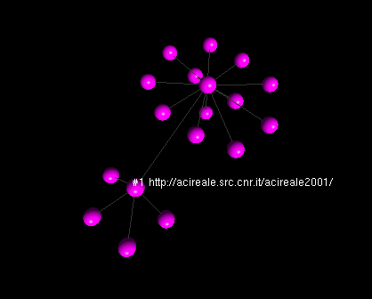

.. _console-label:

The pyWebGraph console
======================

The pyWebGraph console is meant as a tool to explore WebGrph data. A sample session could be::

	$ jython -m pywebgraph.console
	Welcome to pyWebGraph console!
	>> graph example
	>> pwn
	#0
	>> ls
	0: #1 
	1: #342 
	... 
	>> urlmap example
	>> pwn
	#0 http://acireale.src.cnr.it/
	>> ls #0
	0: #1 http://acireale.src.cnr.it/acireale2001/
	1: #342 http://acireale.src.cnr.it/htm/diretta.htm
	...
	>> cn http://acireale.src.cnr.it/acireale2001/
	
First of all you load a graph with the :samp:`graph` command, then you can explore it (much like you would do with your filesystem): using :samp:`pwn` and :samp:`cn` (to print and change, respectively, the working node) and using :samp:`ls` to list outlinks. Additionaly, with :samp:`urlmap`, you can load a map from node numbers to URLs (and *vice versa*) that will be used when printing (and identifying) nodes.

Node specifications
-------------------

A node can be specified to commands of the console in three ways:

* as an absolute node number (a non negative integer prefixed by ``#``),
* as a node name (any string enclosed in double quotes -- use :samp:`urlmap` to load a suitable map from node names to numbers, and viceversa),
* as a path (absolute, or relative to the current working node).

A :dfn:`relative path` is a sequence of non negative integers separated by ``/``, if it also starts with ``/``, it is said to be an :dfn:`absolute path`; the :dfn:`current working node` is a given node of the graph with respect to which relative paths are to be considered. Numbers in the sequence refer to outlinks (that are numbered starting from 0). For example, path ``/2/4`` referes to the fifth outlink of the third outlink of node 0; similarly, path ``1//2`` refers to the third outlink af the second outlink of the current working node.

.. note::

	Since web graphs need not to be connected, it is not true in general that every node can be specified with an absolute path (that is a path relative to node 0), or that evey relative path can be converted to an absolute path. 
	The navigational methaphor hence differs from the filesystem case, corresponding to a (of course connected) tree.

Visualization
-------------

If the console is given the ``-r/--renderer`` command line option pointing to a Ubigraph server, then the console can be used to visualize WebGraph data using the commands  :samp:`add`, :samp:`highlight`, :samp:`label`, and :samp:`clear`; please use the :samp:`help` console command for details. 

A sample session could be::

	$ jython -m pywebgraph.console -r-
	Welcome to pyWebGraph console!
	>> graph example
	>> urlmap example
	>> add 0
	>> add 1
	>> label 0 on

This could give an output like

XML-RPC Server
--------------

It is likely that one wants to use this library with a standard Python interpreter (say one that supports the Python 2.6 version). This is made possible by limiting the need of a Java capable interpreter (like Jython that supports only the Python 2.5 vesrion) to the code accessing WebGraph, allowing any other interpreter to access the data via XML-RPC.

Two low level components are needed: a server (implemented in module :mod:`pywebgraph.webgraph.server`) exposing the data and a client (implemented in :mod:`pywebgraph.webgraph.client`) able to access it. 

Such mechanism is made available the console via the ``-g/--graph-server`` command line option (and thanks to the fact that :mod:`pywebgraph.webgraph.server` is also executable).

A sample session could be::

	$ jython -m pywebgraph.webgraph.server &
	Listening on port 8000
	$ python2.6 -m pywebgraph.console -g- 
	Welcome to pyWebGraph console!
	>> graph example
	>> ls
	0: #1 
	1: #342 
	... 

